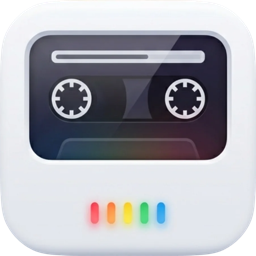
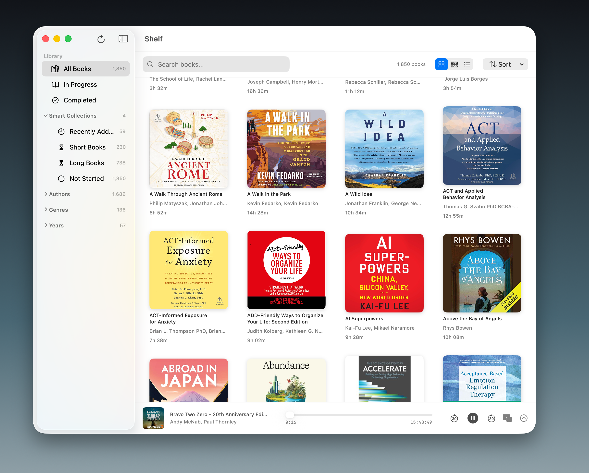
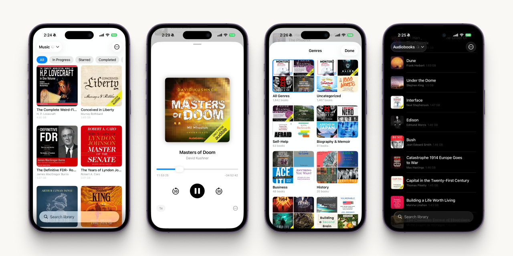

<p align="center">
  
</p>

<h1 align="center">Shelf</h1>

<p align="center">An audiobook player that syncs with Google Drive.<br>Stream or download. Pick up where you left off.</p>

<p align="center"><strong>macOS</strong> · <strong>iOS</strong> · <strong>Android</strong></p>

---

<p align="center">
  
</p>

<p align="center">
  
</p>

<!-- TODO: add android/ screenshot + video demos for macOS and iOS. -->

---

Shelf is a cross-platform audiobook player that reads from your Google Drive. Stream or download, pick up on any device where you left off on another. Ships on macOS, iOS, and Android.

## Features

- **Google Drive sync.** Point Shelf at a Drive folder and your library loads automatically.
- **Stream or download.** Directly from Drive, or saved locally for offline.
- Plays audiobooks (m4b, m4a, mp3, flac). Video files (mp4, mov, mkv) work too.
- Keeps playing with the screen off or the app in the background.
- Chapters, bookmarks, sleep timer, and 0.5x–2.0x playback speed. All persisted.
- Cover art lookup across iTunes, Google Books, and Open Library.
- Filter, sort, search, star, hide, rate, or browse by genre.
- **Discover mode** plays a random book from a random position. **Progress export/import** is JSON and compatible across platforms.

## Platforms

### macOS

Native macOS app with mini player, multiple libraries, sidebar navigation, and keyboard shortcuts. Requires macOS 14+.

[Download DMG](https://github.com/madebysan/shelf/releases/latest) · Swift + SwiftUI + AppKit

<details>
<summary>Keyboard shortcuts</summary>
<br>

| Shortcut | Action |
|----------|--------|
| Space | Play / Pause |
| Cmd + Right | Skip forward 30s |
| Cmd + Left | Skip back 30s |
| Cmd + B | Add bookmark |
| Cmd + Shift + M | Toggle mini player |
| Cmd + R | Refresh library |

</details>

### iOS

iPhone app with background playback, lock-screen controls, fullscreen video with PiP and AirPlay, and video-thumbnail extraction. Requires iOS 17+.

Swift + SwiftUI + AVKit

### Android

Material Design 3 app with streaming playback, offline downloads, background service, haptic feedback, and dark mode. Requires Android 8.0+.

Kotlin + Jetpack Compose + Media3

## Project structure

```
shelf/
├── macos/      # Swift + SwiftUI + AppKit (macOS 14+)
├── ios/        # Swift + SwiftUI + AVKit (iOS 17+)
└── android/    # Kotlin + Jetpack Compose + Media3 (API 26+)
```

## Building

**macOS:**
```bash
cd macos && open Shelf.xcodeproj
# Build and run with Cmd+R
```

**iOS:**
```bash
cd ios && open ShelfIOS.xcodeproj
# Build for device or simulator
```

**Android:**
```bash
cd android
# Open in Android Studio, add google-services.json to app/
```

## Supported formats

**Audio:** m4b, m4a, mp3, flac

**Video:** mp4, mov, mkv, avi, webm

## Free audio to get started

[Open Culture](https://www.openculture.com/freeaudiobooks) maintains a curated list of 1,000+ free audiobooks. Classics from Twain, Orwell, Austen, and more. Download the MP3s, point Shelf at the folder, and start listening.

## License

[MIT](macos/LICENSE)

---

Made by [santiagoalonso.com](https://santiagoalonso.com)
